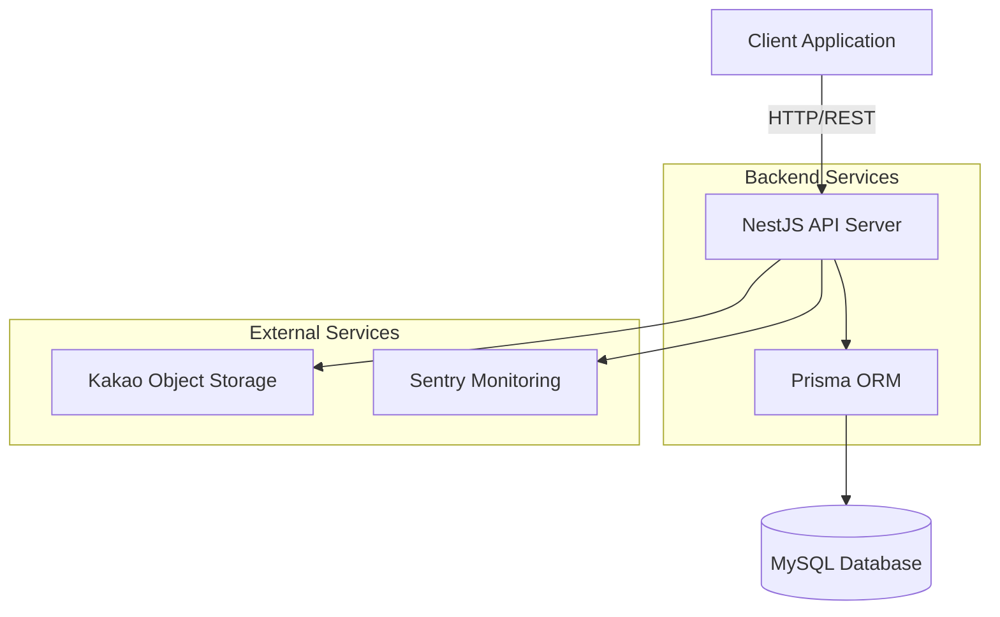

# bagtothefuture Backend

게임 기반 재난안전교육 플랫폼의 백엔드 API

## 🏗️ 아키텍처



## 🚀 기술 스택

- **Node.js v22** - JavaScript 런타임 (nvm 관리)
- **NestJS** - Node.js 프레임워크
- **TypeScript** - 정적 타입 지원
- **Prisma** - ORM (MySQL)
- **Passport** - 인증 (Kakao OAuth)
- **Swagger/OpenAPI** - API 문서화
- **Sentry** - 에러 모니터링
- **Kakao Object Storage** - S3 호환 오브젝트 스토리지
- **Infisical** - 시크릿 관리
- **Jest** - 테스팅 프레임워크
- **ESLint & Prettier** - 코드 품질 관리

## 📁 프로젝트 구조

```
src/
├── app.controller.ts      # 기본 API 컨트롤러
├── app.controller.spec.ts # 컨트롤러 테스트
├── app.service.ts         # 기본 서비스
├── app.module.ts          # 루트 모듈
├── main.ts                # 애플리케이션 진입점
├── instrument.ts          # Sentry 초기화
├── auth/                  # 인증 모듈 (Kakao OAuth, JWT)
│   ├── guards/            # 인증 가드
│   ├── dto/               # 인증 DTO
│   ├── jwt.strategy.ts    # JWT 전략
│   └── kakao.strategy.ts  # Kakao OAuth 전략
├── game/                  # 게임 관리 모듈
│   ├── services/          # 게임 비즈니스 로직
│   └── dto/               # 게임 DTO
├── sessions/              # 게임 세션 관리 모듈
│   ├── dto/               # 세션 DTO
│   └── utils/             # 세션 유틸리티
├── prisma/                # Prisma 모듈/서비스
├── common/                # 공통 유틸리티
│   ├── config/            # 설정 파일
│   ├── decorators/        # 커스텀 데코레이터
│   ├── dto/               # 공통 DTO
│   ├── filters/           # 예외 필터
│   ├── guards/            # 가드
│   ├── interceptors/      # 인터셉터
│   ├── middleware/        # 미들웨어
│   ├── pipes/             # 파이프
│   └── utils/             # 유틸리티 함수
└── modules/               # 확장 모듈 영역 (auth, users)
```

## 🛠️ 시작하기

### Node.js 버전 관리

이 프로젝트는 Node.js v22를 사용합니다. nvm을 사용하여 버전을 관리합니다.

```bash
# nvm 설치 (없는 경우)
curl -o- https://raw.githubusercontent.com/nvm-sh/nvm/v0.40.1/install.sh | bash

# Node.js 22 설치 및 사용
nvm install 22
nvm use

# 또는 .nvmrc 파일 기반으로 자동 설정
nvm use
```

### 환경 변수 설정

`.env.example` 파일을 참고하여 `.env` 파일을 생성하세요.

```bash
cp .env.example .env
```

필수 환경 변수:

- `INFISICAL_SERVICE_TOKEN` - Infisical 서비스 토큰
- `INFISICAL_ENV` - Infisical 환경 (dev/prod)
- `IS_LOCAL` - 로컬 개발 환경 여부 (true/false)

로컬 개발 시 추가 환경 변수 (SSH 터널링):

- `SSH_BASTION_HOST` - SSH Bastion 호스트
- `SSH_BASTION_PORT` - SSH Bastion 포트
- `SSH_BASTION_USERNAME` - SSH 사용자명
- `SSH_PRIVATE_KEY_PATH` - SSH 프라이빗 키 경로
- `SSH_LOCAL_PORT` - 로컬 포트

> **참고**: 대부분의 환경 변수는 Infisical을 통해 관리됩니다. `.env` 파일에는 Infisical 연결 정보만 설정하면 됩니다.

### 패키지 설치

```bash
npm install
```

### 개발 서버 실행

```bash
# 개발 모드
npm run start:dev

# 디버그 모드
npm run start:debug

# 프로덕션 모드
npm run build
npm run start:prod
```

## 🧪 테스트

```bash
# 단위 테스트
npm run test

# 테스트 감시 모드
npm run test:watch

# 커버리지 리포트
npm run test:cov

# E2E 테스트
npm run test:e2e
```

## 📋 개발 가이드

### 코드 품질

프로젝트는 다음 도구를 사용하여 코드 품질을 관리합니다:

- **ESLint** - 코드 린팅
- **Prettier** - 코드 포매팅
- **Husky** - Git 훅 관리
- **lint-staged** - 스테이징된 파일만 린트

```bash
# 린팅
npm run lint

# 포매팅
npm run format
```

### 브랜치 전략

```
main (프로덕션) ← feature/*, fix/*, refactor/*
```

브랜치 네이밍 규칙:

- `feature/기능명` - 새로운 기능 개발
- `fix/버그명` - 버그 수정
- `refactor/개선명` - 코드 리팩토링
- `chore/작업명` - 기타 작업

### 커밋 메시지 컨벤션

```
feat: 새로운 기능 추가
fix: 버그 수정
refactor: 코드 리팩토링
chore: 빌드, 설정 변경
docs: 문서 수정
test: 테스트 코드 추가/수정
```

예시:

```bash
git commit -m "feat: 게임 세션 생성 API 추가"
git commit -m "fix: 인증 토큰 만료 처리 버그 수정"
```

### Pull Request 프로세스

1. 기능 브랜치 생성
2. 코드 작성 및 테스트
3. PR 생성 (main 브랜치로)
4. CI 통과 및 코드 리뷰 진행
5. 승인 후 머지

### 기여하기

기여 방법은 `CONTRIBUTING.md`를, 보안 이슈는 `SECURITY.md`를 참고하세요.

### 문서

- 설계 의도 및 제약사항: `docs/design-decisions.md`
- 배포 가이드: `docs/deployment-guide.md`
- 트러블슈팅: `docs/troubleshooting.md`

## 🚀 배포

### CI/CD 파이프라인

GitHub Actions를 사용한 자동화된 배포:

- **CI (Continuous Integration)**
  - PR 생성 시 자동 린트 및 테스트 실행
  - 코드 품질 검증

- **CD (Continuous Deployment)**
  - `main` 브랜치 머지 시 프로덕션 환경 자동 배포

워크플로우 파일:

- `.github/workflows/kakao_ci_pr.yml` - PR 검증
- `.github/workflows/kakao_ci.yml` - CI 파이프라인
- `.github/workflows/kakao_cd.yml` - CD 파이프라인

### 환경변수 관리

- **개발 환경**: `.env`+ Infisical (시크릿 관리)
- **프로덕션 환경**: `.env` + Infisical (시크릿 관리)

환경별 설정은 `.env.example`을 참고하세요.

## 📡 API 문서

### API 엔드포인트

- **Swagger UI**: `http://localhost:3000/api/docs` - 대화형 API 문서
- **API 접근**: `http://localhost:3000/api` - 실제 API 엔드포인트

개발 서버 실행 후 Swagger UI에서 모든 API를 테스트할 수 있습니다.

### 주요 엔드포인트

- `GET /api` - Hello World 메시지
- `GET /api/health` - 헬스 체크
- `GET /api/game/*` - 게임 관련 API
- `POST /api/sessions/*` - 게임 세션 관련 API

## 🔒 보안

주요 보안 사항:

- `.env` 파일은 절대 커밋하지 마세요
- 환경 변수는 `.env.example`에 예시만 추가
- 모든 개발/프로덕션 환경변수는 Infisical로 관리

## 📝 Acknowledgement

본 프로젝트는 카카오임팩트 테크포임팩트 프로그램을 통해 개발되었습니다.

[](https://techforimpact.io/)


**Copyright (c) 2025 bagtothefuture**

---

**문의사항**

- 기술 문의: [GitHub Issues](https://github.com/the-promise-lab/backend/issues)
- 테크포임팩트 프로그램: https://techforimpact.io/
